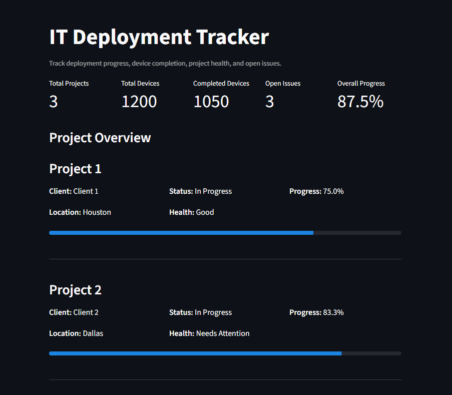

## Dashboard Preview

# IT Deployment Tracker

A Python-based IT deployment tracking application that uses SQLite for data storage and Streamlit for an interactive dashboard.

The project was designed to track deployment progress, device completion, open issues, project health, and overall status across multiple IT projects.

## Project Purpose

The goal of this project is to provide a simple way to record and monitor IT deployment activity.

Project information is entered through a Python application, stored in a SQLite database, and displayed through a Streamlit dashboard for easier tracking and reporting.

The tracker helps provide visibility into:

- Total projects
- Total devices
- Completed devices
- Open issues
- Completion percentage
- Project status
- Project health

## Technologies Used

- Python
- SQLite
- Streamlit
- Git
- GitHub
- SQL

## How It Works

1. Project information is entered through the Python application.
2. The application calculates project completion percentage.
3. Project status is automatically assigned based on progress.
4. Project health is calculated based on the number of open issues.
5. Project information is stored in a SQLite database.
6. Streamlit reads the stored data and displays it in an interactive dashboard.

## Project Status Logic

| Completion | Status |
|---|---|
| 0% | Not Started |
| 1–99% | In Progress |
| 100% | Completed |

## Project Health Logic

| Open Issues | Health |
|---|---|
| 0 | Good |
| 1–3 | Needs Attention |
| More than 3 | At Risk |

## Dashboard Features

The Streamlit dashboard displays:

- Total number of projects
- Total devices across deployments
- Number of completed devices
- Open issues
- Overall deployment progress
- Individual project progress
- Project status
- Project health

## Demo Data

The deployed version includes sample project data to demonstrate how the application works.

The SQLite database used locally is excluded from the public repository so that project data is not committed to GitHub.

## Live Application

View the deployed application here:

https://it-deployment-tracker-3j229fhoxhmsaovghzssbo.streamlit.app/

## Project Scope

This project was built as a small hands-on application to demonstrate database-backed application development, project tracking, data analysis, and dashboard reporting using Python, SQLite, and Streamlit.
